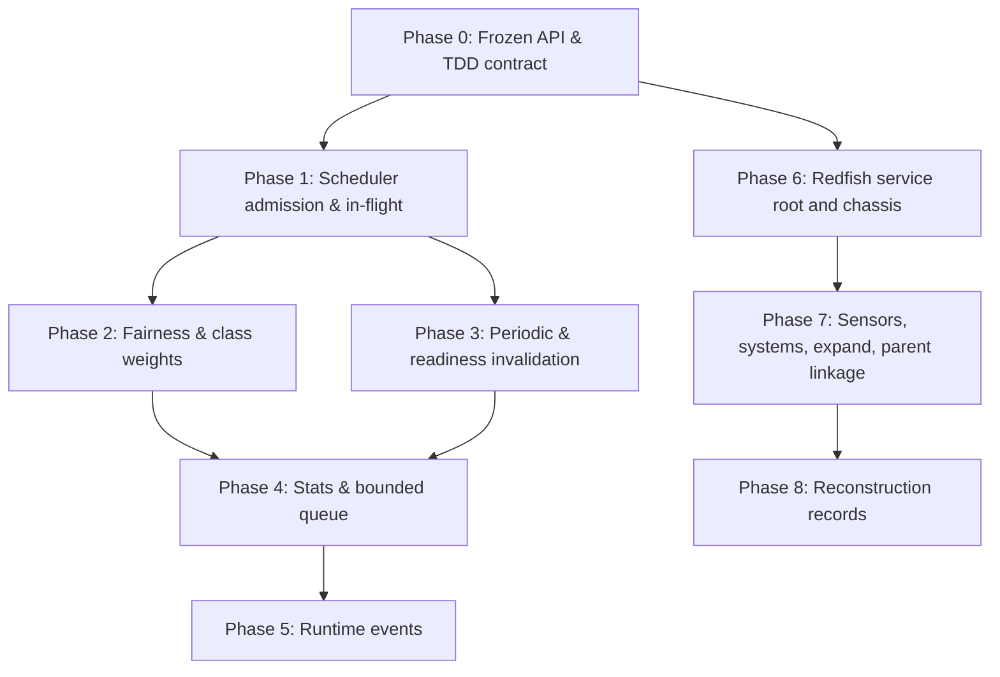

# Scraper Implementation Phases

This document is the index for the scraper crate's phased implementation.
Phase 0 establishes the public API, the in-tree generic runtime skeleton,
the Redfish adapter type-only boundary, and the **frozen test contract**.
Subsequent phases turn red tests in `scraper/tests/*.rs` green by editing
only `scraper/src/*`. No test, fixture, or feature flag is moved or
renamed during a later phase.

Each per-phase document below lists:

- the test groups (or specific tests) it must turn green;
- the design decisions taken in that phase; and
- the explicit acceptance criteria.

## Phase index

| Phase | Theme | Document |
| ----- | ----- | -------- |
| 0 | Public API & frozen TDD contract | [phase-0.md](phase-0.md) |
| 1 | Scheduler admission, cost, anti-starvation, in-flight semantics | [phase-1.md](phase-1.md) |
| 2 | Class weights, target fairness | [phase-2.md](phase-2.md) |
| 3 | Periodic generators, tree-change readiness invalidation | [phase-3.md](phase-3.md) |
| 4 | Stats expansion (lag/missed/actual), bounded queue accounting | [phase-4.md](phase-4.md) |
| 5 | Runtime events (work bracketing, lag, queue pressure, control plane) | [phase-5.md](phase-5.md) |
| 6 | Redfish adapter: real service-root and chassis fetch via Bmc | [phase-6.md](phase-6.md) |
| 7 | Sensors, computer systems, expand, parent linkage, EntityPayload | [phase-7.md](phase-7.md) |
| 8 | Reconstruction records derivation from resource events | [phase-8.md](phase-8.md) |

## Dependency graph

Phase 1 unblocks both fairness work (Phase 2) and the periodic-generator
machinery (Phase 3). Phase 4 stats and queue accounting are the bedrock
on which Phase 5 runtime events sit. The Redfish track (Phases 6–8) is
independent of the scheduler track once Phase 0 lands; only Phase 5
runtime events benefit from Phase 4 stats.

## Test groups, mapped to phases

| File | Test group | Phase that turns it green |
| ---- | ---------- | ------------------------- |
| `tests/scheduling.rs` | cost admission, expensive starvation, in-flight cap | Phase 1 |
| `tests/scheduling.rs` | class weights | Phase 2 |
| `tests/scheduling.rs` | target fairness | Phase 2 |
| `tests/scheduling.rs` | tree-change readiness invalidation, periodic depth | Phase 3 |
| `tests/output.rs` | bounded queue pressure stats | Phase 4 |
| `tests/stats.rs` | generator lag/actual_interval | Phase 4 |
| `tests/stats.rs` | bounded queue dropped accounting | Phase 4 |
| `tests/runtime_events.rs::emission::*` | work bracketing, lag, pressure, control plane | Phase 5 |
| `tests/completion.rs` | in-flight removal completion is still called | Phase 1 |
| `tests/completion.rs` | lag observable from completion-derived stats | Phase 4 |
| `tests/redfish_adapter_api.rs` | real fetch (service root, chassis) | Phase 6 |
| `tests/redfish_adapter_api.rs` | sensors, systems, expand, parent linkage | Phase 7 |
| `tests/redfish_adapter_api.rs` | reconstruction record derivation | Phase 8 |

## Conventions for later phases

- Edit only `scraper/src/*`. Tests, fixtures, and trybuild snapshots are
  fixed by Phase 0.
- A phase is complete when **every** test listed in its document is
  green and **no** previously-green test goes red.
- Strict clippy posture is preserved: `cargo clippy -p nv-redfish-scraper
  --all-features --all-targets -- -D warnings` must succeed.
- Documentation lives next to the code; phase docs reference test names
  exactly so the link from prose to assertion is always one search away.
